### Symbols

- `000`: `adv_checkpoints/fgsm-r2-b16/BaseCNN-00000.pt`
- `001`: `adv_checkpoints/fgsm-r2-b16/BaseCNN-00001.pt`
- `002`: `adv_checkpoints/fgsm-r2-b16/BaseCNN-00002.pt`
- `003`: `adv_checkpoints/fgsm-r2-b16/BaseCNN-00003.pt`
- `004`: `adv_checkpoints/fgsm-r2-b16/BaseCNN-00004.pt`
- `005`: `adv_checkpoints/fgsm-r2-b16/BaseCNN-00005.pt`
- `006`: `None`

### Similarities

#### `backbone.conv1.weight`
Shape: `torch.Size([1])`

##### corr
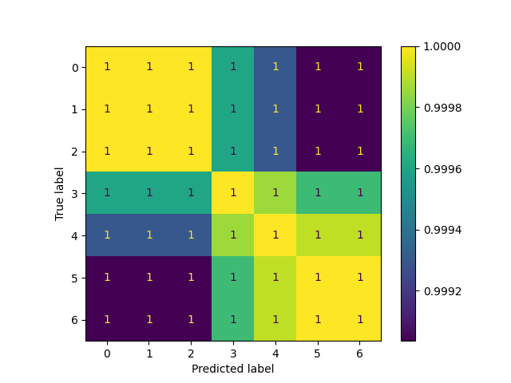

#### `backbone.bn1.weight`
Shape: `torch.Size([1])`

##### corr
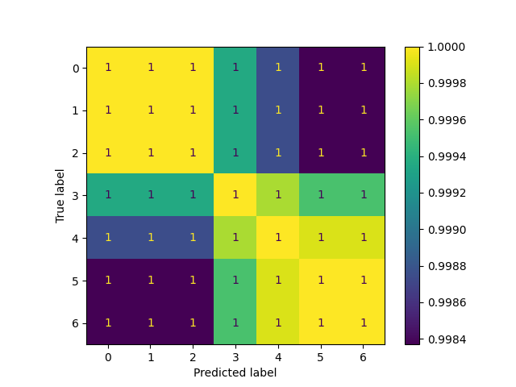

#### `backbone.bn1.bias`
Shape: `torch.Size([1])`

##### corr
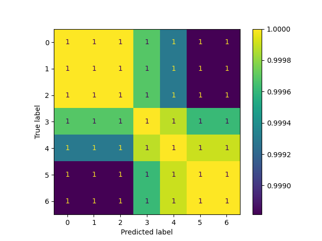

#### `backbone.layer1.0.conv1.weight`
Shape: `torch.Size([1])`

##### corr
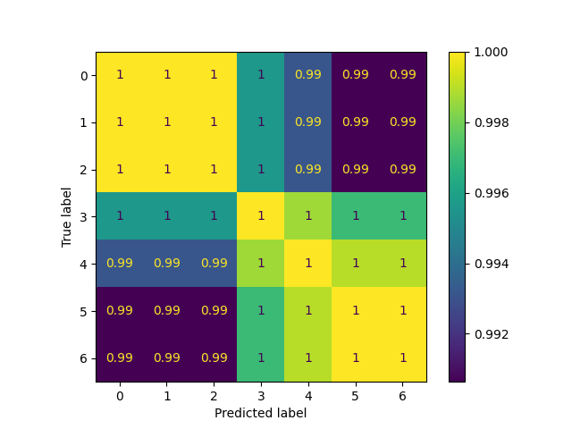

#### `backbone.layer1.0.bn1.weight`
Shape: `torch.Size([1])`

##### corr
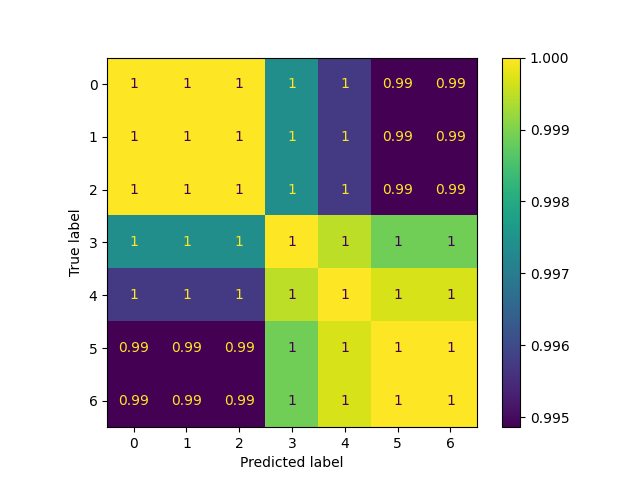

#### `backbone.layer1.0.bn1.bias`
Shape: `torch.Size([1])`

##### corr

#### `backbone.layer1.0.conv2.weight`
Shape: `torch.Size([1])`

##### corr
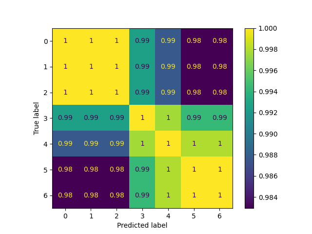

#### `backbone.layer1.0.bn2.weight`
Shape: `torch.Size([1])`

##### corr

#### `backbone.layer1.0.bn2.bias`
Shape: `torch.Size([1])`

##### corr

#### `backbone.layer1.1.conv1.weight`
Shape: `torch.Size([1])`

##### corr

#### `backbone.layer1.1.bn1.weight`
Shape: `torch.Size([1])`

##### corr
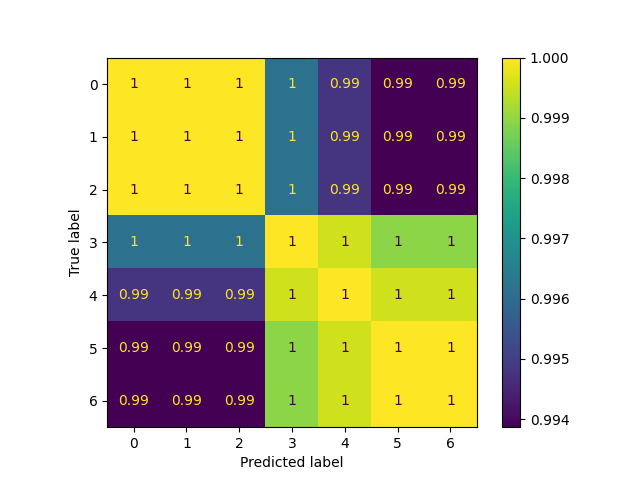

#### `backbone.layer1.1.bn1.bias`
Shape: `torch.Size([1])`

##### corr
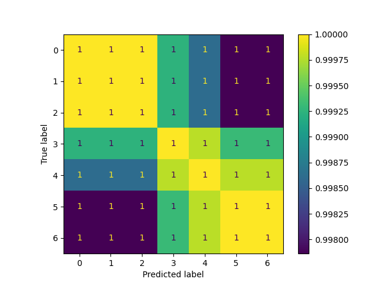

#### `backbone.layer1.1.conv2.weight`
Shape: `torch.Size([1])`

##### corr

#### `backbone.layer1.1.bn2.weight`
Shape: `torch.Size([1])`

##### corr
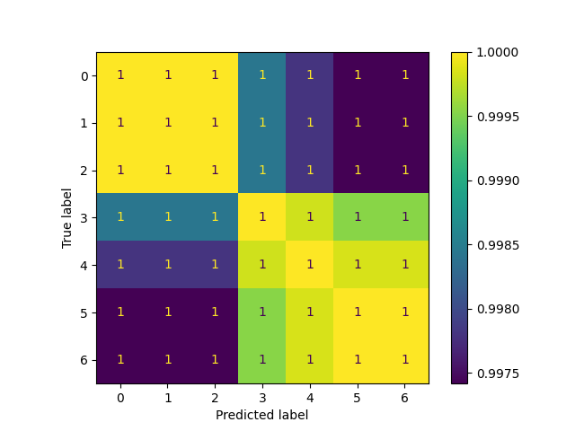

#### `backbone.layer1.1.bn2.bias`
Shape: `torch.Size([1])`

##### corr

#### `backbone.layer1.2.conv1.weight`
Shape: `torch.Size([1])`

##### corr

#### `backbone.layer1.2.bn1.weight`
Shape: `torch.Size([1])`

##### corr
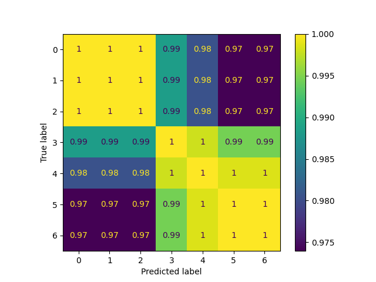

#### `backbone.layer1.2.bn1.bias`
Shape: `torch.Size([1])`

##### corr

#### `backbone.layer1.2.conv2.weight`
Shape: `torch.Size([1])`

##### corr
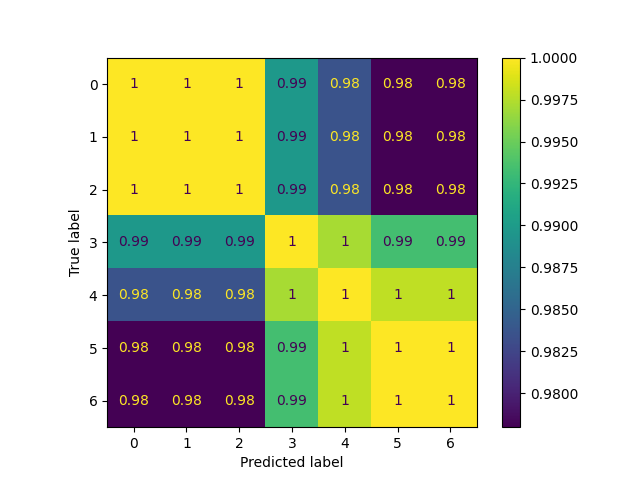

#### `backbone.layer1.2.bn2.weight`
Shape: `torch.Size([1])`

##### corr
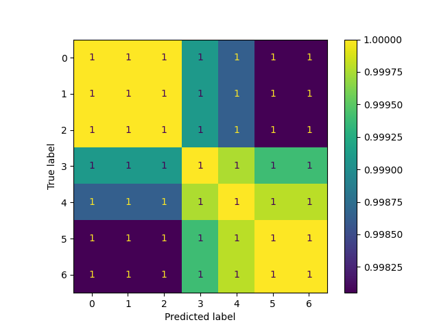

#### `backbone.layer1.2.bn2.bias`
Shape: `torch.Size([1])`

##### corr
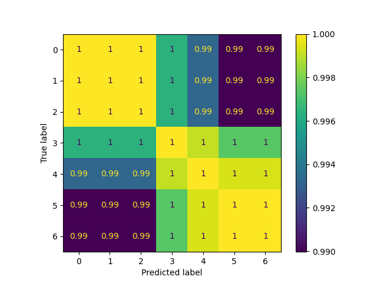

#### `backbone.layer2.0.conv1.weight`
Shape: `torch.Size([1])`

##### corr

#### `backbone.layer2.0.bn1.weight`
Shape: `torch.Size([1])`

##### corr

#### `backbone.layer2.0.bn1.bias`
Shape: `torch.Size([1])`

##### corr

#### `backbone.layer2.0.conv2.weight`
Shape: `torch.Size([1])`

##### corr

#### `backbone.layer2.0.bn2.weight`
Shape: `torch.Size([1])`

##### corr

#### `backbone.layer2.0.bn2.bias`
Shape: `torch.Size([1])`

##### corr

#### `backbone.layer2.0.downsample.0.weight`
Shape: `torch.Size([1])`

##### corr
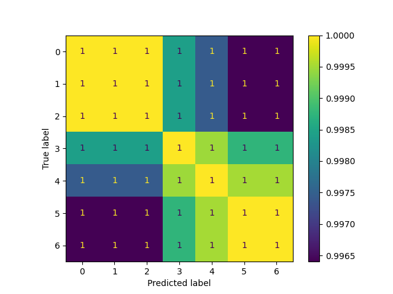

#### `backbone.layer2.0.downsample.1.weight`
Shape: `torch.Size([1])`

##### corr

#### `backbone.layer2.0.downsample.1.bias`
Shape: `torch.Size([1])`

##### corr

#### `backbone.layer2.1.conv1.weight`
Shape: `torch.Size([1])`

##### corr
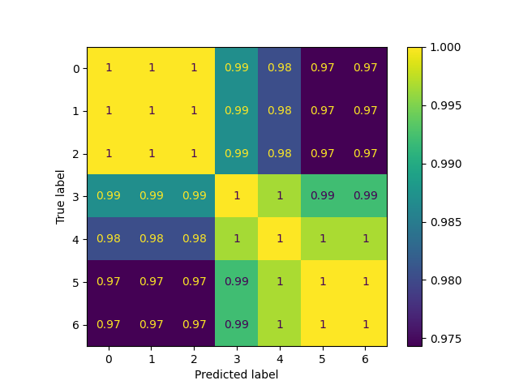

#### `backbone.layer2.1.bn1.weight`
Shape: `torch.Size([1])`

##### corr

#### `backbone.layer2.1.bn1.bias`
Shape: `torch.Size([1])`

##### corr

#### `backbone.layer2.1.conv2.weight`
Shape: `torch.Size([1])`

##### corr

#### `backbone.layer2.1.bn2.weight`
Shape: `torch.Size([1])`

##### corr
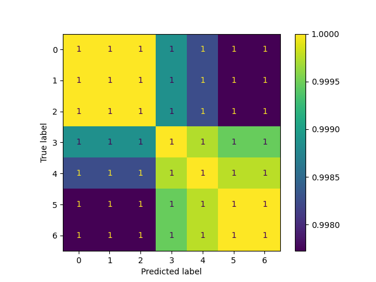

#### `backbone.layer2.1.bn2.bias`
Shape: `torch.Size([1])`

##### corr

#### `backbone.layer2.2.conv1.weight`
Shape: `torch.Size([1])`

##### corr

#### `backbone.layer2.2.bn1.weight`
Shape: `torch.Size([1])`

##### corr
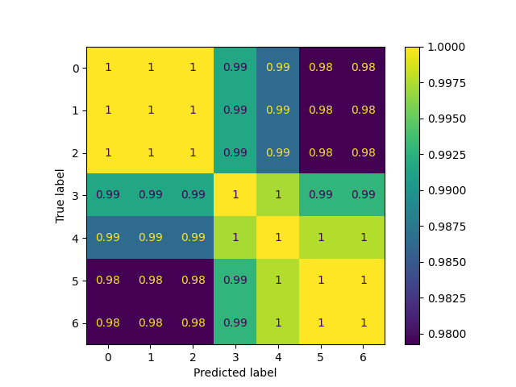

#### `backbone.layer2.2.bn1.bias`
Shape: `torch.Size([1])`

##### corr
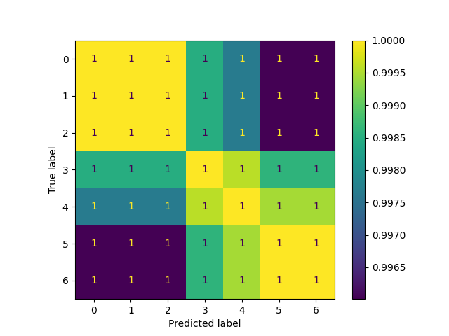

#### `backbone.layer2.2.conv2.weight`
Shape: `torch.Size([1])`

##### corr
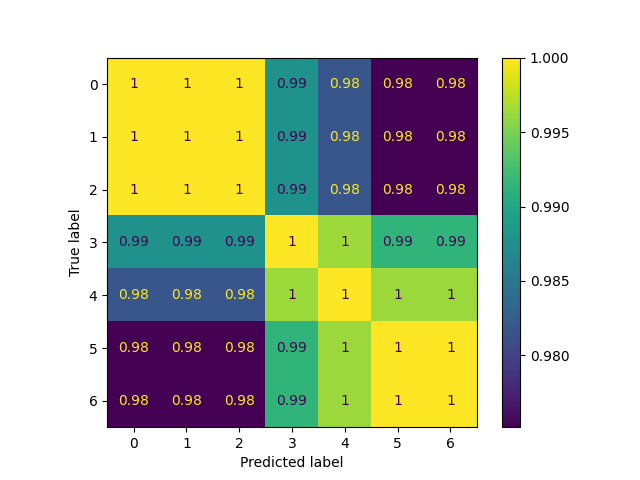

#### `backbone.layer2.2.bn2.weight`
Shape: `torch.Size([1])`

##### corr
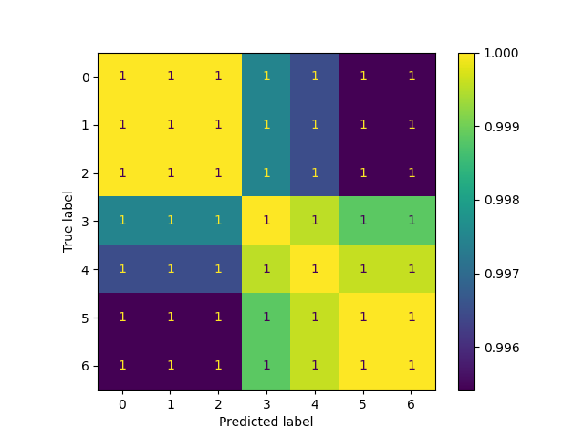

#### `backbone.layer2.2.bn2.bias`
Shape: `torch.Size([1])`

##### corr

#### `backbone.layer2.3.conv1.weight`
Shape: `torch.Size([1])`

##### corr

#### `backbone.layer2.3.bn1.weight`
Shape: `torch.Size([1])`

##### corr

#### `backbone.layer2.3.bn1.bias`
Shape: `torch.Size([1])`

##### corr
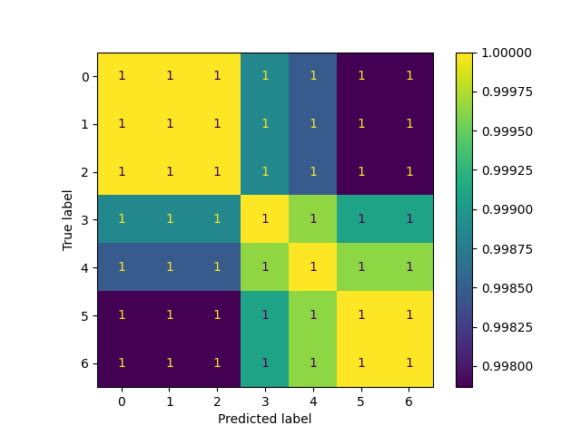

#### `backbone.layer2.3.conv2.weight`
Shape: `torch.Size([1])`

##### corr
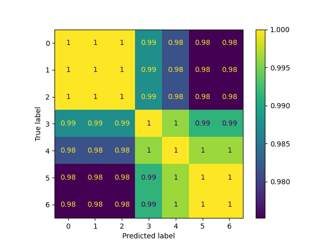

#### `backbone.layer2.3.bn2.weight`
Shape: `torch.Size([1])`

##### corr

#### `backbone.layer2.3.bn2.bias`
Shape: `torch.Size([1])`

##### corr

#### `backbone.layer3.0.conv1.weight`
Shape: `torch.Size([1])`

##### corr
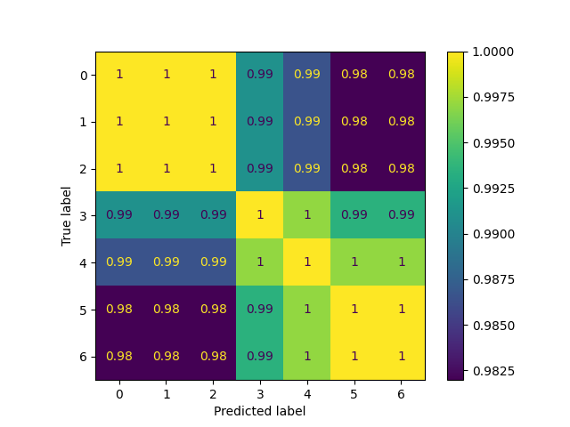

#### `backbone.layer3.0.bn1.weight`
Shape: `torch.Size([1])`

##### corr
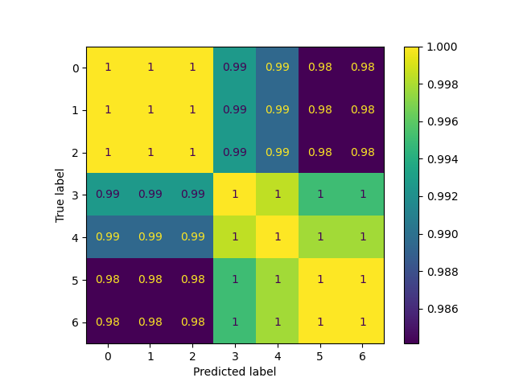

#### `backbone.layer3.0.bn1.bias`
Shape: `torch.Size([1])`

##### corr

#### `backbone.layer3.0.conv2.weight`
Shape: `torch.Size([1])`

##### corr

#### `backbone.layer3.0.bn2.weight`
Shape: `torch.Size([1])`

##### corr

#### `backbone.layer3.0.bn2.bias`
Shape: `torch.Size([1])`

##### corr

#### `backbone.layer3.0.downsample.0.weight`
Shape: `torch.Size([1])`

##### corr
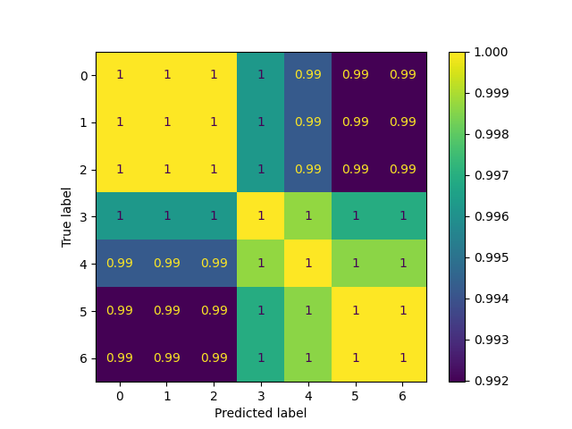

#### `backbone.layer3.0.downsample.1.weight`
Shape: `torch.Size([1])`

##### corr
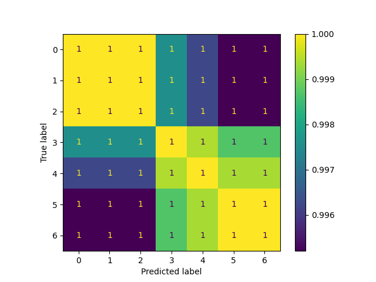

#### `backbone.layer3.0.downsample.1.bias`
Shape: `torch.Size([1])`

##### corr

#### `backbone.layer3.1.conv1.weight`
Shape: `torch.Size([1])`

##### corr

#### `backbone.layer3.1.bn1.weight`
Shape: `torch.Size([1])`

##### corr

#### `backbone.layer3.1.bn1.bias`
Shape: `torch.Size([1])`

##### corr

#### `backbone.layer3.1.conv2.weight`
Shape: `torch.Size([1])`

##### corr

#### `backbone.layer3.1.bn2.weight`
Shape: `torch.Size([1])`

##### corr

#### `backbone.layer3.1.bn2.bias`
Shape: `torch.Size([1])`

##### corr

#### `backbone.layer3.2.conv1.weight`
Shape: `torch.Size([1])`

##### corr

#### `backbone.layer3.2.bn1.weight`
Shape: `torch.Size([1])`

##### corr

#### `backbone.layer3.2.bn1.bias`
Shape: `torch.Size([1])`

##### corr

#### `backbone.layer3.2.conv2.weight`
Shape: `torch.Size([1])`

##### corr

#### `backbone.layer3.2.bn2.weight`
Shape: `torch.Size([1])`

##### corr

#### `backbone.layer3.2.bn2.bias`
Shape: `torch.Size([1])`

##### corr

#### `backbone.layer3.3.conv1.weight`
Shape: `torch.Size([1])`

##### corr
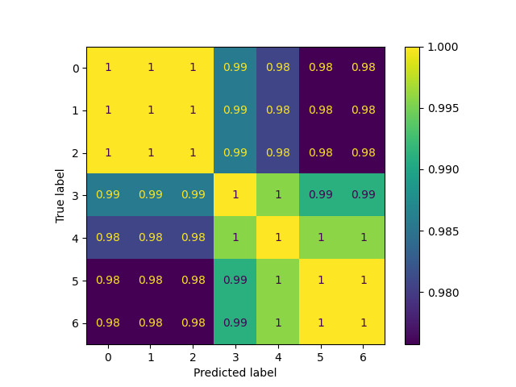

#### `backbone.layer3.3.bn1.weight`
Shape: `torch.Size([1])`

##### corr
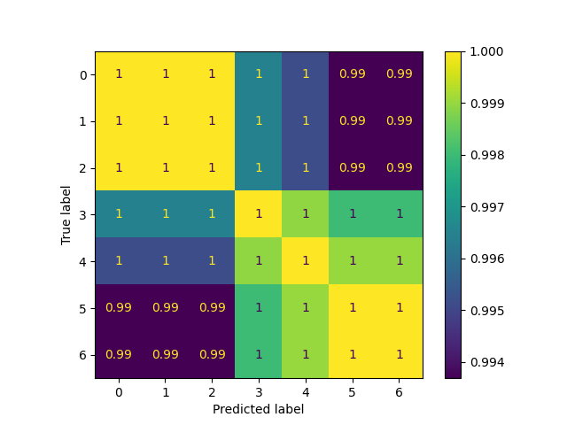

#### `backbone.layer3.3.bn1.bias`
Shape: `torch.Size([1])`

##### corr
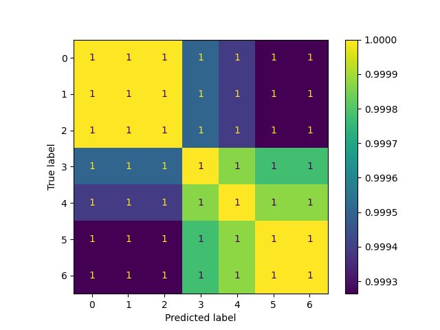

#### `backbone.layer3.3.conv2.weight`
Shape: `torch.Size([1])`

##### corr

#### `backbone.layer3.3.bn2.weight`
Shape: `torch.Size([1])`

##### corr
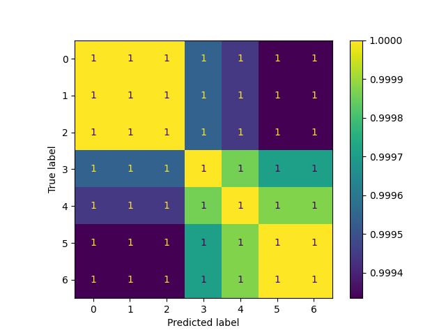

#### `backbone.layer3.3.bn2.bias`
Shape: `torch.Size([1])`

##### corr
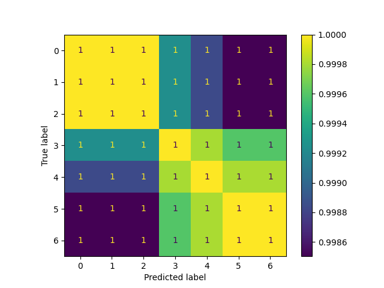

#### `backbone.layer3.4.conv1.weight`
Shape: `torch.Size([1])`

##### corr

#### `backbone.layer3.4.bn1.weight`
Shape: `torch.Size([1])`

##### corr
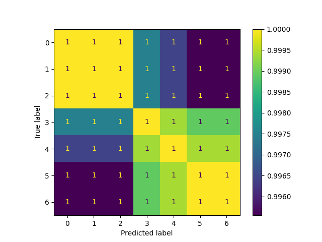

#### `backbone.layer3.4.bn1.bias`
Shape: `torch.Size([1])`

##### corr

#### `backbone.layer3.4.conv2.weight`
Shape: `torch.Size([1])`

##### corr

#### `backbone.layer3.4.bn2.weight`
Shape: `torch.Size([1])`

##### corr

#### `backbone.layer3.4.bn2.bias`
Shape: `torch.Size([1])`

##### corr
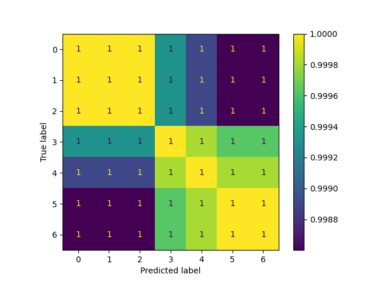

#### `backbone.layer3.5.conv1.weight`
Shape: `torch.Size([1])`

##### corr

#### `backbone.layer3.5.bn1.weight`
Shape: `torch.Size([1])`

##### corr

#### `backbone.layer3.5.bn1.bias`
Shape: `torch.Size([1])`

##### corr
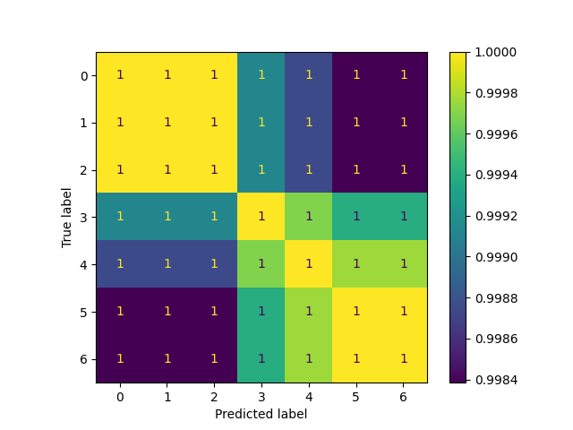

#### `backbone.layer3.5.conv2.weight`
Shape: `torch.Size([1])`

##### corr

#### `backbone.layer3.5.bn2.weight`
Shape: `torch.Size([1])`

##### corr
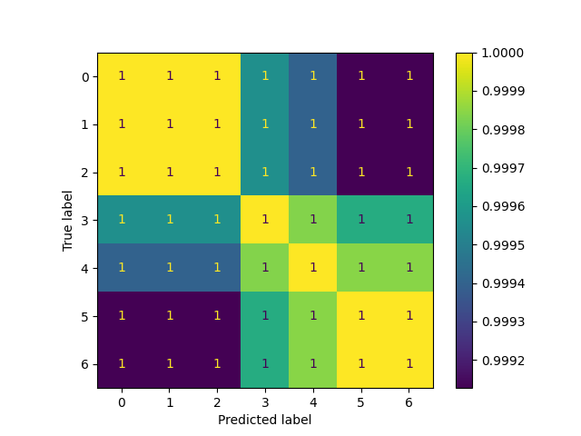

#### `backbone.layer3.5.bn2.bias`
Shape: `torch.Size([1])`

##### corr
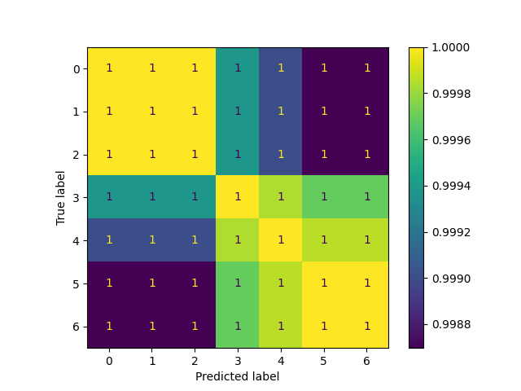

#### `backbone.layer4.0.conv1.weight`
Shape: `torch.Size([1])`

##### corr
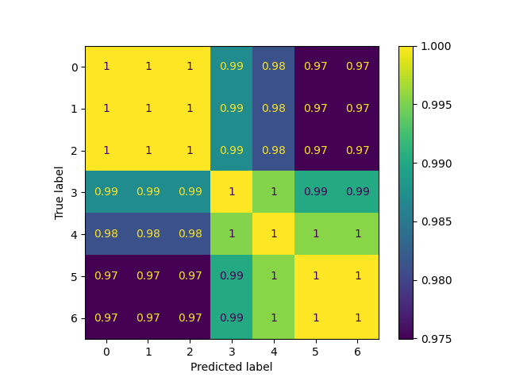

#### `backbone.layer4.0.bn1.weight`
Shape: `torch.Size([1])`

##### corr

#### `backbone.layer4.0.bn1.bias`
Shape: `torch.Size([1])`

##### corr

#### `backbone.layer4.0.conv2.weight`
Shape: `torch.Size([1])`

##### corr

#### `backbone.layer4.0.bn2.weight`
Shape: `torch.Size([1])`

##### corr
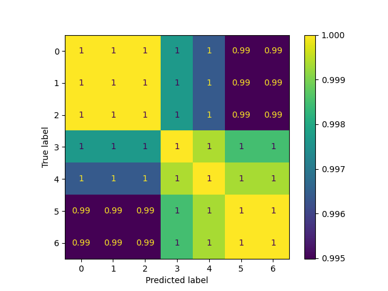

#### `backbone.layer4.0.bn2.bias`
Shape: `torch.Size([1])`

##### corr

#### `backbone.layer4.0.downsample.0.weight`
Shape: `torch.Size([1])`

##### corr

#### `backbone.layer4.0.downsample.1.weight`
Shape: `torch.Size([1])`

##### corr

#### `backbone.layer4.0.downsample.1.bias`
Shape: `torch.Size([1])`

##### corr

#### `backbone.layer4.1.conv1.weight`
Shape: `torch.Size([1])`

##### corr

#### `backbone.layer4.1.bn1.weight`
Shape: `torch.Size([1])`

##### corr

#### `backbone.layer4.1.bn1.bias`
Shape: `torch.Size([1])`

##### corr
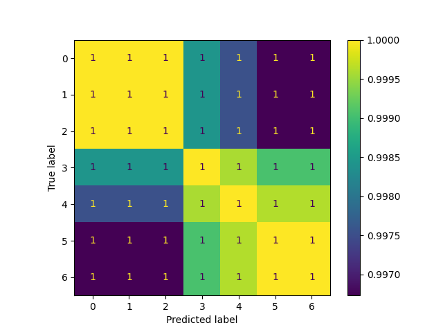

#### `backbone.layer4.1.conv2.weight`
Shape: `torch.Size([1])`

##### corr
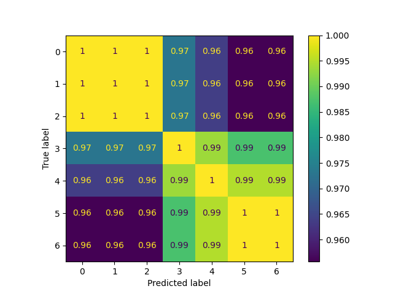

#### `backbone.layer4.1.bn2.weight`
Shape: `torch.Size([1])`

##### corr
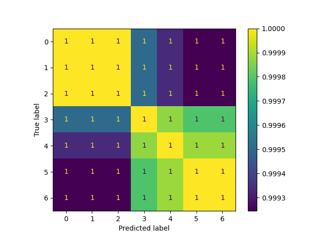

#### `backbone.layer4.1.bn2.bias`
Shape: `torch.Size([1])`

##### corr

#### `backbone.layer4.2.conv1.weight`
Shape: `torch.Size([1])`

##### corr
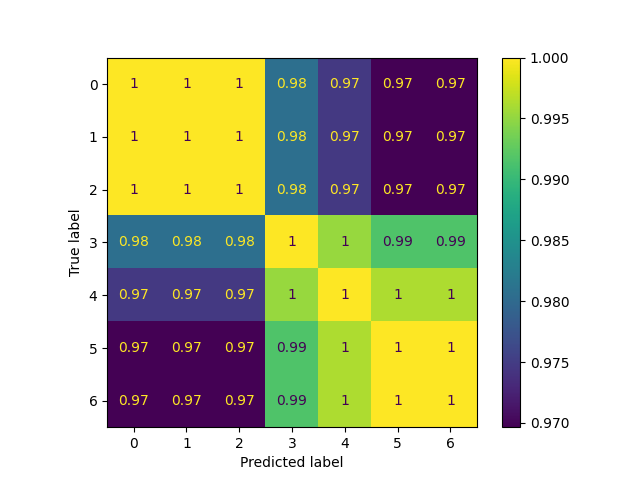

#### `backbone.layer4.2.bn1.weight`
Shape: `torch.Size([1])`

##### corr
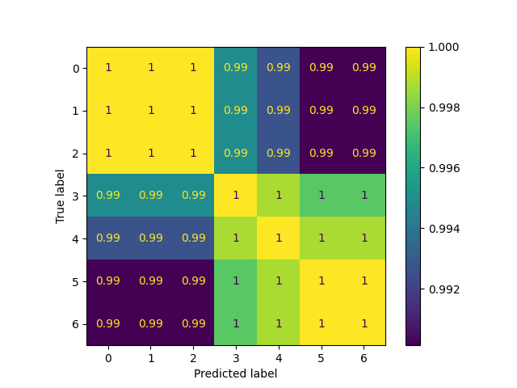

#### `backbone.layer4.2.bn1.bias`
Shape: `torch.Size([1])`

##### corr

#### `backbone.layer4.2.conv2.weight`
Shape: `torch.Size([1])`

##### corr
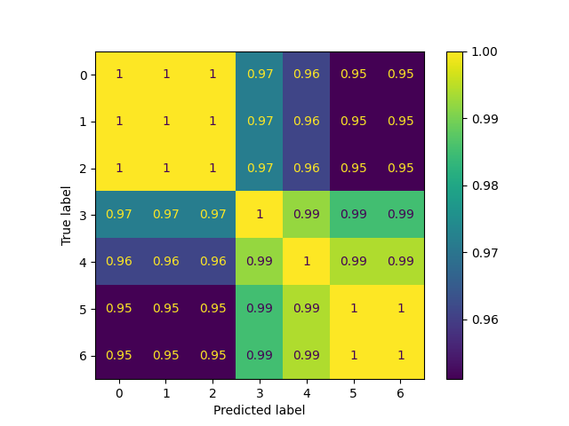

#### `backbone.layer4.2.bn2.weight`
Shape: `torch.Size([1])`

##### corr
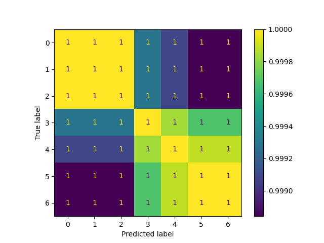

#### `backbone.layer4.2.bn2.bias`
Shape: `torch.Size([1])`

##### corr
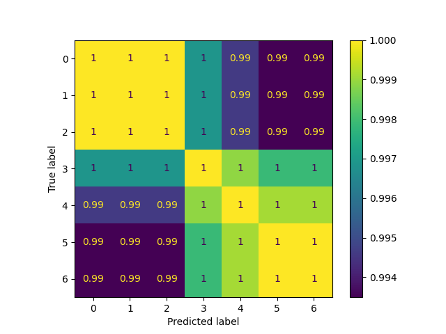

#### `backbone.fc.weight`
Shape: `torch.Size([1])`

##### corr
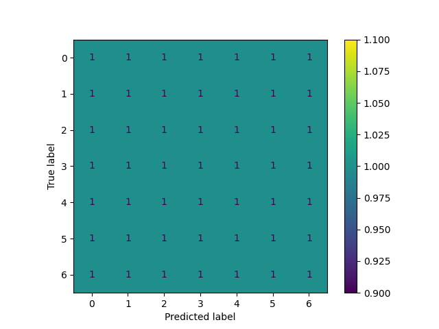

#### `backbone.fc.bias`
Shape: `torch.Size([1])`

##### corr

#### `fc.weight`
Shape: `torch.Size([1])`

##### corr
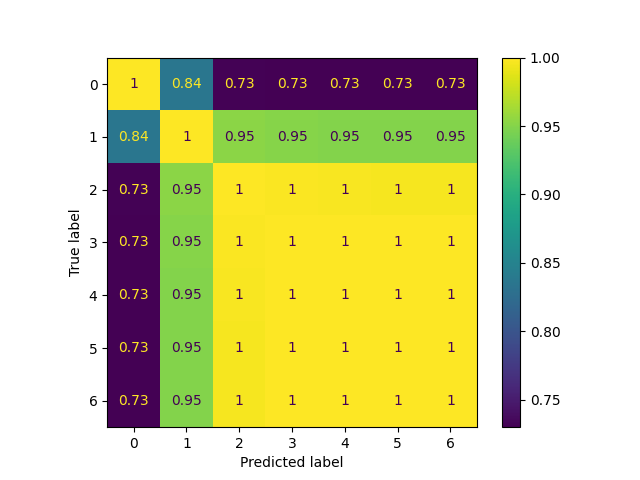

#### `fc.bias`
Shape: `torch.Size([1])`

##### corr
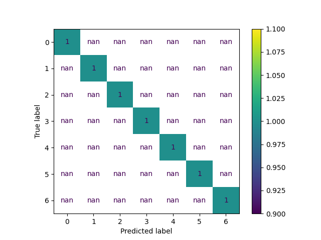

