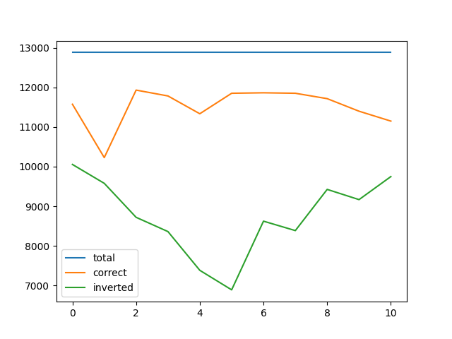

### Symbols

- `000`: `None`
- `001`: `adv_checkpoints/bl2rfgsm-r2-long-training/BaseCNN-00000.pt`
- `002`: `adv_checkpoints/bl2rfgsm-r2-long-training/BaseCNN-00008.pt`
- `003`: `adv_checkpoints/bl2rfgsm-r2-long-training/BaseCNN-00016.pt`
- `004`: `adv_checkpoints/bl2rfgsm-r2-long-training/BaseCNN-00024.pt`
- `005`: `adv_checkpoints/bl2rfgsm-r2-long-training/BaseCNN-00032.pt`
- `006`: `adv_checkpoints/bl2rfgsm-r2-long-training/BaseCNN-00040.pt`
- `007`: `adv_checkpoints/bl2rfgsm-r2-long-training/BaseCNN-00048.pt`
- `008`: `adv_checkpoints/bl2rfgsm-r2-long-training/BaseCNN-00056.pt`
- `009`: `adv_checkpoints/bl2rfgsm-r2-long-training/BaseCNN-00064.pt`
- `010`: `adv_checkpoints/bl2rfgsm-r2-long-training/BaseCNN-00072.pt`

### Training scores

### Testing scores

### Adversarial

#### Radius = 0.02

##### live

#### Radius = 0.05

##### live

#### Radius = 0.10

##### live

### Adversarial Training

