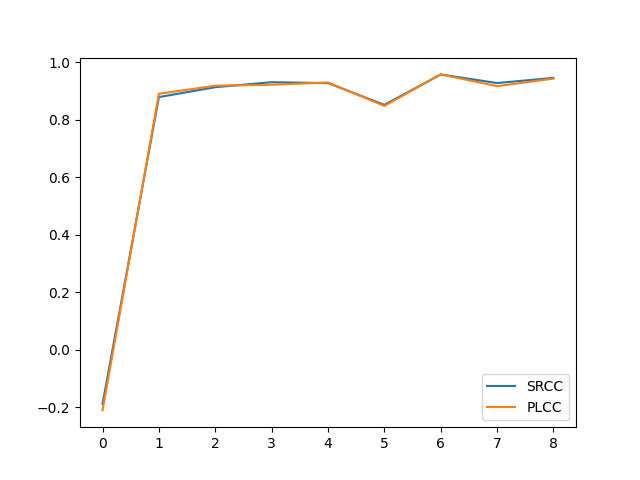
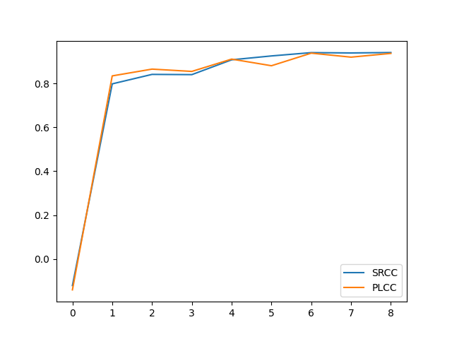
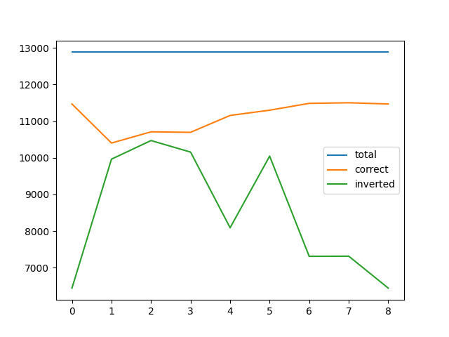
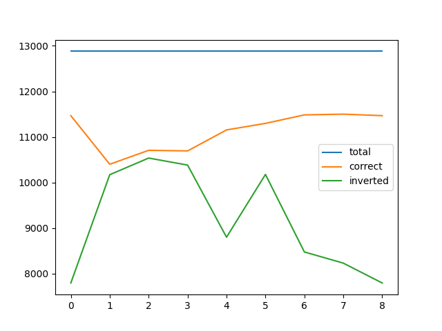
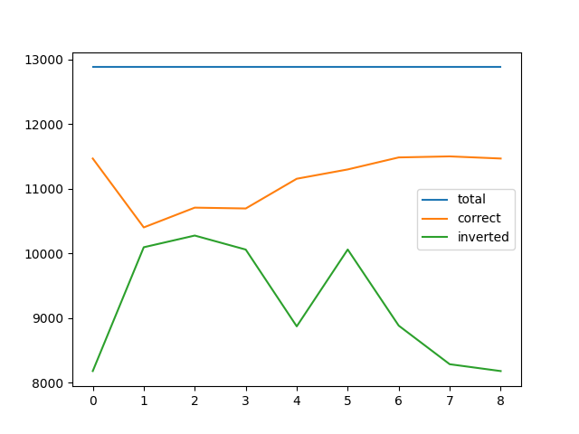

### Symbols

- `000`: `None`
- `001`: `adv_checkpoints/pl2rfgsm-r2/BaseCNN-00000.pt`
- `002`: `adv_checkpoints/pl2rfgsm-r2/BaseCNN-00001.pt`
- `003`: `adv_checkpoints/pl2rfgsm-r2/BaseCNN-00002.pt`
- `004`: `adv_checkpoints/pl2rfgsm-r2/BaseCNN-00003.pt`
- `005`: `adv_checkpoints/pl2rfgsm-r2/BaseCNN-00004.pt`
- `006`: `adv_checkpoints/pl2rfgsm-r2/BaseCNN-00005.pt`
- `007`: `adv_checkpoints/pl2rfgsm-r2/BaseCNN-00006.pt`
- `008`: `adv_checkpoints/pl2rfgsm-r2/BaseCNN-00007.pt`

### Training scores

### Testing scores

### Adversarial

#### Radius = 0.02

##### live

#### Radius = 0.05

##### live

#### Radius = 0.10

##### live

### Adversarial Training

